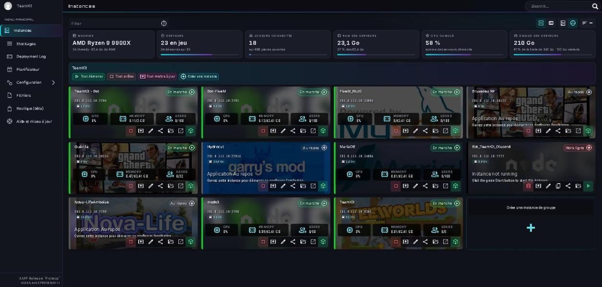
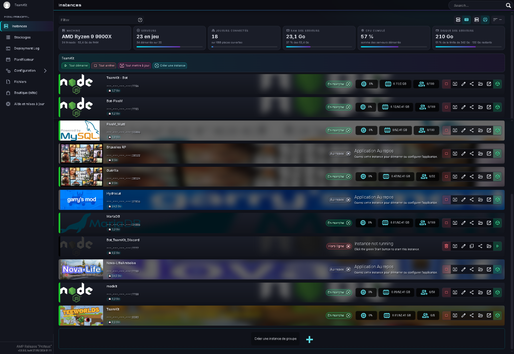
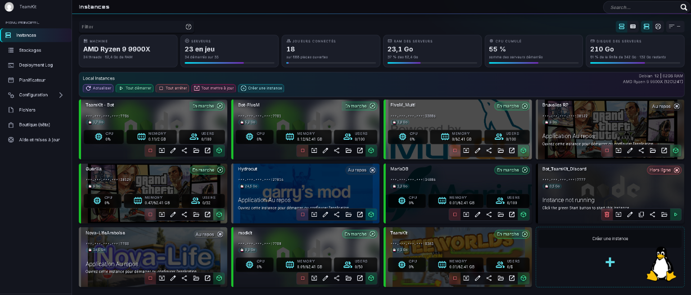
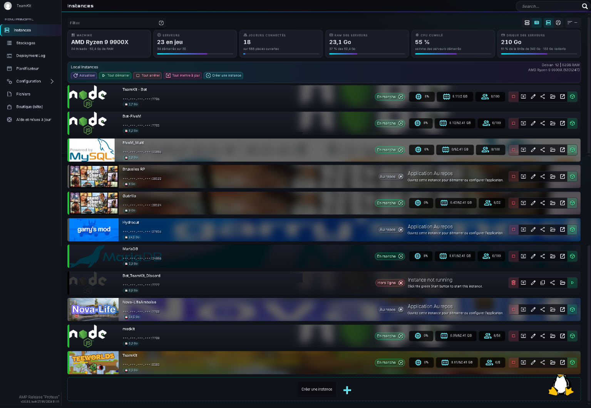
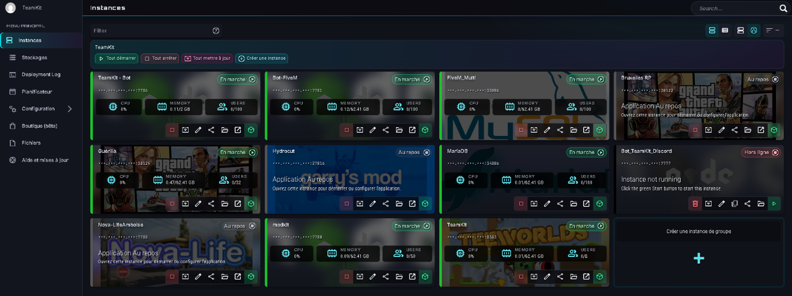
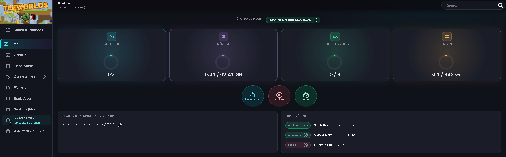

# AMP add-ons: themes, stats bar, disk limits and French translation for CubeCoders AMP

> **🇫🇷 Version française complète : [LISEZMOI.md](LISEZMOI.md)** · 🇬🇧 English below

Free, unofficial add-ons for the [AMP game server panel by CubeCoders](https://cubecoders.com/AMP): two dark themes
(one with a game-HUD Status page), a live **stats bar** for the whole machine, a **Disk** gauge with **per-instance disk
limits** and an optional disk guard, and **AMP in French** with an FR | EN switch. Made and used daily on the
[TeamKit](https://www.teamkit.fr) game servers (French gaming community, free hosted servers). Installs with one command
on Linux, no AMP file is replaced.

| Add-on | What it does | How it is installed |
|---|---|---|
| **TeamKit theme** | dark night-blue theme with soft cyan and violet accents, tuned for long sessions | a CSS theme, the official way |
| **TeamKit-HUD theme** | the same theme, plus a game-HUD Status page: three large glowing gauges and big round buttons | a CSS theme, the official way |
| **Stats bar** | tiles above the instance list: machine, servers running, players online, RAM, CPU, datastore usage and limit; a `💾 X GB` badge on each instance card; a fourth **Disk** gauge on the Status page of every instance | one JavaScript file + one line in `AMP.html` |
| **Disk limits and guard** | a limit per game or per instance in one config file: gauges and badges show `used / limit`, and (optionally) the game is stopped when the disk is full, File Manager and SFTP staying open | `disk-guard.py`, every 5 minutes (optional) |
| **AMP in French** | the panel in French for French browsers, with an FR / EN switch; game settings included | `TeamKitLang.js` + `fr.json` |

## Screenshots

The stats bar works in **all four layouts** of the Instances page (the four buttons at the top right: cards or list, by group or by machine). Each instance also gets a `💾` disk badge.

| Cards, by group | List, by group |
|---|---|
|  |  |
| **Cards, by machine** | **List, by machine** |
|  |  |

**The same page without the add-on** (theme only):



**TeamKit-HUD: the instance Status page** with its large gauges and round buttons. The fourth gauge, **Disk** (instance disk / datastore limit), is added by the stats script:



*Screenshots taken on the TeamKit panel; server addresses are hidden.*

## ⚠️ Disclaimer — use at your own risk

These add-ons are shared **as is**, for free, by a passionate hobbyist. They work on **my own setup** (AMP 2.8.0.8, Debian 12,
Docker instances, see *Compatibility*), but **I cannot test every AMP install, version or configuration**.

- **Make a backup before installing** (at least `WebRoot/AMP.html` and your instances' important data). The installer keeps
  a copy of `AMP.html`, but that is not a full backup.
- **You install and run them under your own responsibility.** I am **not responsible** for any damage, data loss, downtime,
  broken instance or any other problem on your AMP, your servers or your machine, even if it seems linked to these add-ons.
- Nothing obliges you to use them, and you are free to read, change or remove every line: the code is open and readable.
- The disk guard can **stop the game** of an instance when set to do so (`enforce`): test it in display mode and with
  `--dry-run` first.
- **Not affiliated with CubeCoders.** Before asking CubeCoders support for help, uninstall the add-ons or mention them.

Legal terms: [MIT License](LICENSE) (*"THE SOFTWARE IS PROVIDED AS IS, WITHOUT WARRANTY OF ANY KIND"*).

## Install in one command (recommended)

On the machine where AMP runs (over SSH, or PuTTY from Windows), copy this line, paste it, press Enter:

```sh
curl -fsSL https://raw.githubusercontent.com/hydrocut/amp-addons-teamkit/main/setup.sh -o /tmp/amp-addons-setup.sh && sudo sh /tmp/amp-addons-setup.sh
```

The installer asks the **language** (English / Français), finds your ADS instance, shows what is already installed,
then lets you pick, with yes / no questions:

- the themes, the stats bar and Disk gauge, AMP in French;
- the automatic repair after AMP updates (cron, every 30 minutes);
- the disk limits and guard, set up by questions (display mode, default limit, thresholds, stop the game or not).

**Run it again any time**: choose *Only update what is installed* to get the new version, *Install or update* to add
the new features, or *Uninstall everything*. Nothing is ever restarted. Next times, it is already on the machine:

```sh
sudo sh /opt/amp-addons-teamkit/setup.sh
```

No `curl`? `sudo apt-get install -y curl` first (or `git`, the installer uses whichever is there).

## Manual install, step by step

The same, without the questions, if you prefer to see each step.

You need: AMP already installed on a **Linux** machine (the usual install from cubecoders.com), and a terminal on
that machine with `sudo` (over SSH, or PuTTY from Windows). Each grey block is **one command**: copy it, paste it,
press Enter, wait for the prompt to come back.

**1. Get the add-ons** (once):

```sh
sudo apt-get install -y git python3
```

```sh
sudo git clone https://github.com/hydrocut/amp-addons-teamkit.git /opt/amp-addons-teamkit
```

**2. Install them** (themes, stats bar, French; nothing is restarted):

```sh
sudo sh /opt/amp-addons-teamkit/install-stats.sh
```

It answers `Installed. Reload the ADS page (Ctrl+F5).` If your ADS instance is not called `ADS01`, add its name:
`sudo sh /opt/amp-addons-teamkit/install-stats.sh MyADS`.

**3. In your browser**: open AMP, press **Ctrl+F5**. To use a theme: ADS → **Configuration** → theme
**TeamKit** or **TeamKit-HUD** → save. A browser set to French now shows AMP in French, with an **FR | EN**
switch next to the search box.

**4. Keep it after AMP updates** (recommended): an AMP update removes the add-ons, this puts them back within 30 minutes.

```sh
echo '*/30 * * * * root sh /opt/amp-addons-teamkit/install-stats.sh >/dev/null' | sudo tee /etc/cron.d/amp-addons-teamkit
```

**5. Optional, disk limits**: see [section 3](#3-disk-limits-and-disk-guard-optional).

**Update the add-ons later** (new version on GitHub):

```sh
sudo git -C /opt/amp-addons-teamkit pull && sudo sh /opt/amp-addons-teamkit/install-stats.sh
```

### Compatibility

| | Status |
|---|---|
| AMP 2.8.0.8 "Proteus" | ✅ tested (everything) |
| Other AMP 2.8.x | should work; themes are safe, scripts only read what the page already loads |
| AMP 2.7 and older | not tested |
| Linux: Debian 12 | ✅ tested |
| Linux: Ubuntu, other Debian-based | should work (needs `sh`, `sed`, `cmp`, `install`; `python3` for the disk guard) |
| AMP on Windows | themes: copy the CSS by hand into `WebRoot\Themes` of the ADS instance; scripts and installer: **not supported** |
| Instances in Docker or not | ✅ both (tested with Docker) |
| Several machines (ADS + targets) | stats bar sums every target; disk guard and installer run on the ADS machine; only tested on one machine |
| Browsers | Chrome / Edge ✅ tested; Firefox 121+ should work (the 4-gauge layout needs CSS `:has()`) |

### What it changes on your machine (and what it does not)

- **Themes**: two CSS files in `WebRoot/Themes/`, the official way to add a theme.
- **Scripts**: copied to `WebRoot/Scripts/`, plus **one line each** in `WebRoot/AMP.html` (backup kept). This is the only
  unofficial part: AMP has no add-on system for its web page. Nothing else of AMP is modified, no AMP program file,
  no setting, no instance.
- **Read-only in the browser**: the scripts only call what the AMP page itself already uses (`GetInstances`,
  `GetDatastores`); they never change a setting.
- **Disk guard** (only if you install it): uses AMP's official API with an account you create, and in display mode
  changes nothing at all.
- **Remove everything**: see *Uninstall* below; your AMP is back to normal.

## 1. Themes (official, safe)

AMP loads any CSS file placed in `ADS01/WebRoot/Themes/`.

1. Copy `TeamKit.css` (or `TeamKit-HUD.css`) to `/home/amp/.ampdata/instances/ADS01/WebRoot/Themes/`.
2. In ADS, open **Configuration**, pick the theme, save. The ADS theme also applies to every instance page opened from ADS.
3. Preview without switching: `https://<your-amp>/ThemePreview.html?theme=TeamKit`.

`install-stats.sh` copies both themes for you. If a theme already comes from the official AMP theme store
(`Themes/AMPThemes/<Name>/`), the installer leaves it to the store: a local file with the same name would win over
the store copy and could hide a newer version. It only ever removes a theme file it placed itself.

Both themes are also proposed to the official theme store ([CubeCoders/AMPThemes](https://github.com/CubeCoders/AMPThemes)).

## 2. Stats bar (unofficial, read-only)

A theme cannot add data, so this one is a script. It only **reads** what ADS already sends to the page:

- `API.ADSModule.GetInstancesAsync()`: machine (`Platform.CPUInfo`, `InstalledRAMMB`) and, per instance, `Running`,
  `AppState` (20 = running), `DiskUsageMB` and `Metrics["CPU Usage" | "Memory Usage" | "Active Users"]`;
- `API.ADSModule.GetDatastoresAsync()`: `CurrentUsageMB` and `SoftLimitMB` of each datastore.

It changes nothing, refreshes every 15 s, and fails silently (no error can break ADS).

- The **bar** is shown to users who have `Core.UserManagement.ViewActiveSessions` (admins).
- The **disk badges** are shown to everyone, each user seeing only their own instances.
- The **Disk gauge** on an instance Status page is shown to everyone who can open that instance. Its ring is the
  instance disk divided by the datastore soft limit (the only limit ADS knows); without access to the datastores the ring stays empty.
- Texts follow the FR | EN switch (section 4), otherwise the browser language.

### Requirements

- AMP with an ADS controller on Linux. Tested on **AMP 2.8.0.8** (Proteus), instances in Docker containers.
- A recent browser (the 4-gauge layout uses CSS `:has()`). Tested with Chrome.
- Root (or the `amp` user) on the machine, to copy one file and edit `AMP.html`.

### Install (Linux)

```sh
sudo sh install-stats.sh            # ADS01 and the folder of the script by default
sudo sh install-stats.sh MyADS /path/to/amp-addons-teamkit
```

The script copies `TeamKitStats.js` into `WebRoot/Scripts/`, adds a single `<script>` line before `</body>` of
`WebRoot/AMP.html`, and keeps a backup (`AMP.html.before-stats-<date>`). Reload the Instances page with Ctrl+F5.

It can be run as often as you like: when everything is already in place it touches nothing and prints
`Already installed.` The `?v=` cache number only changes when the script itself changed.

### Every instance, including the ones created later

Nothing is installed per instance. When you open an instance from ADS, its page is loaded in a frame of the ADS page
(same address, `/instance/<InstanceID>`). The script running in ADS finds that frame, reads the instance disk usage
from `GetInstancesAsync()` (`DiskUsageMB`) and adds the **Disk** gauge next to CPU, Memory and Users, by copying AMP's
own CPU gauge, so it follows the theme. An instance created tomorrow, by hand or by an automation, gets it straight away.

Only exception: someone who logs in **directly** on an instance's own web port (not through ADS) does not load the
ADS page, so no gauge there.

### Keep it after AMP updates (optional cron)

An AMP update rewrites `AMP.html` and drops the `<script>` line. Since the installer only writes when something is
missing, a cron job can put it back by itself:

```sh
# /etc/cron.d/teamkit-stats : every 30 minutes, silent when there is nothing to do
*/30 * * * * root sh /opt/amp-addons-teamkit/install-stats.sh >/dev/null
```

Use absolute paths (cron does not start in the repository folder). Custom themes in `WebRoot/Themes/` can also be
removed by an update: keep a copy and put them back if the theme switches to the default.

### Things to know

- **An AMP update rewrites `AMP.html`**: the bar disappears (nothing breaks). Run `install-stats.sh` again, or use the cron line above.
- RAM and CPU are the **sum of the instances**, not a measure of the whole machine (the OS and Docker are not counted).
- ADS does not report the free space of the disk, only the datastore usage and its soft limit.
- Disk figures come from ADS (`DiskUsageMB`), which measures them now and then: a few minutes of delay is normal.
- Before contacting CubeCoders support about the web interface, uninstall it or mention it.

### Troubleshooting

| What you see | What to check |
|---|---|
| Nothing changed | Reload with **Ctrl+F5**. In the browser console, `document.querySelector('script[src*=TeamKitStats]')` must not be `null`; if it is, `AMP.html` was rewritten: run the installer again. |
| Badges and gauge, but no bar | The bar is for admins only (`Core.UserManagement.ViewActiveSessions`). |
| No bar for an admin | `typeof API` in the console must be `"object"`; `localStorage.tkStatsOff` must not be `"1"`. |
| No Disk gauge on a Status page | Open the instance from ADS, not from its own port. Wait 15 s (one refresh). |
| The theme went back to default | An AMP update removed `WebRoot/Themes/TeamKit*.css`: run the installer again. |
| No FR / EN switch | `fr.json` must be in `WebRoot/Locale/` (open `https://<your-amp>/Locale/fr.json`: it must load). Ctrl+F5. |
| Still French after clicking EN | Ctrl+F5. Old version of `TeamKitLang.js`: update. In the console, `localStorage.AMPLocale` must be `""`. |
| A text stays in English | It is not in the dictionary yet, or AMP builds it from several pieces: open an issue with the exact text. |

### Uninstall

Easiest: `sudo sh /opt/amp-addons-teamkit/setup.sh` → *Uninstall everything*. By hand: restore the newest `AMP.html.before-stats-*` (or delete the `TeamKitStats.js` line), then delete `WebRoot/Scripts/TeamKitStats.js`
and the cron line if you added one.

### Customise

- Hide it in one browser only: run `localStorage.tkStatsOff = '1'` in the console (`localStorage.removeItem('tkStatsOff')` to bring it back).
- Who sees the bar: change the permission in `estAdmin()`.
- Refresh rate: `15000` (ms) in `rafraichir()`.
- Placement: the bar is inserted before the first visible `div.ServerGroupContainer`; badges go under the `h3` of each `div.ServerEntry`.
- Disk gauge colour: `#f0b35a` in `styleCadre()`; the gauge is placed after the Users gauge (`ActiveUsers`).
- Colours come from the theme variables (`--tk-carte`, `--tk-bord`, `--tk-texte`…) with dark fallbacks, so it also fits other themes.

## 3. Disk limits and disk guard (optional)

AMP does not limit the disk of an instance. `disk-guard.py` adds that, with one config file:

- **Display**: the Disk gauge and the `💾` badges show `used / limit` and turn **orange** at the warning threshold,
  **red** at 100 %. The admin bar counts the instances over their limit.
- **Guard** (off by default): above the stop threshold it stops the **game** of the instance (`Core/Stop`).
  The AMP instance itself keeps running, so its **File Manager and SFTP stay open** to delete files. An instance
  restarted while still full is stopped again on the next run. Optional Discord webhook (warning once a day, stop once an hour).

Python 3.7+, standard library only, runs every 5 minutes from cron or a systemd timer.

### The config file

Copy `disk-limits.example.json` to `/etc/amp-addons-teamkit/disk-limits.json` (`chmod 600`: it may hold a webhook).

| Key | Meaning |
|---|---|
| `display` | what the Disk gauge compares: `instance-limit` (this instance / its own limit, falls back to the datastore when it has none), `instance-datastore` (this instance / datastore limit), `all-datastore` (all instances / datastore limit) |
| `default_limit_gb` | limit for every instance without a more precise one (`0` = none) |
| `templates` | limit per game, in GB, by the name AMP shows (`ModuleDisplayName`, e.g. `"Empyrion Galactic Survival"`, or `Module`, e.g. `"Minecraft"`) |
| `instances` | limit per instance, in GB, by `InstanceName`, `FriendlyName` or `InstanceID` — wins over `templates` |
| `warn_pct`, `stop_pct` | warning and stop thresholds, in % of the limit (default 90 and 100) |
| `enforce` | `false` = display only (default). `true` = stop the game above `stop_pct` |
| `webhook` | optional Discord webhook URL for warnings and stops |
| `amp` | `url`, `user`, `password_file`: an AMP account allowed to see and stop the instances. Needed for `enforce`, and to turn instance names into IDs |
| `ads_instance`, `ampdata` | where ADS lives (`ADS01`, `/home/amp/.ampdata/instances`) |
| `import` | optional: `url` of a JSON `{"instances_mb": {"<InstanceID>": MB}, "warn_pct": n, "stop_pct": n}` (plus `header` and `secret_file` if it needs a key), to take the limits from your own panel or database |

Precedence for one instance: `instances` > `import` > `templates` > `default_limit_gb`.

### Install

```sh
sudo install -d -m 700 /etc/amp-addons-teamkit
sudo install -m 600 /opt/amp-addons-teamkit/disk-limits.example.json /etc/amp-addons-teamkit/disk-limits.json
sudo nano /etc/amp-addons-teamkit/disk-limits.json            # write your limits (Ctrl+O to save, Ctrl+X to quit)
sudo python3 /opt/amp-addons-teamkit/disk-guard.py --dry-run --verbose   # shows what it would do
```

Then every 5 minutes (one command, creates `/etc/cron.d/amp-disk-guard`):

```sh
echo '*/5 * * * * root /usr/bin/python3 /opt/amp-addons-teamkit/disk-guard.py >> /var/log/amp-disk-guard.log 2>&1' | sudo tee /etc/cron.d/amp-disk-guard
```

It writes `WebRoot/Scripts/TeamKitDisk.json` in the ADS instance (only when something changed): display mode,
thresholds and limits. **This file is readable without logging in**, so it only holds **fingerprints** (FNV-1a, computed
the same way by the page): no instance ID, server name or game name, and never the account, the password or the webhook.

For the AMP account, create a dedicated user in ADS with access to the instances (and only that); put its password
alone in the `password_file` (`chmod 600`).

### Good to know

- Disk figures come from ADS (`DiskUsageMB`), measured now and then: after a clean-up, the gauge can take a few
  minutes to follow, and a game restarted too early may be stopped once more.
- Stopping the game is not a hard quota: files written while the game is stopped (uploads by SFTP) are not blocked.
- Test with `"enforce": false` and `--dry-run` first.

## 4. AMP in French (optional)

AMP 2.8 already contains a translation engine (`Scripts/Locale.js`, dictionaries in `WebRoot/Locale/<iso>.json`),
but nothing in the interface turns it on. `TeamKitLang.js` does, with `fr.json`, a French dictionary of about
3 200 phrases: the panel pages, ADS settings, permissions, scheduler tasks and triggers, and the **Configuration** of 22 kinds of
instances (Minecraft Java and Bedrock, Garry's Mod, Counter-Strike 1.6 and Source, FiveM, Barotrauma, DDNet,
Teeworlds, Luanti, BeamMP, SA-MP, RimWorld, Eco, Empyrion, Euro Truck Simulator 2, Farming Simulator 25, Node.js,
MySQL, MariaDB, PostgreSQL…).

- Browsers set to French get the panel in French; everyone else keeps English.
- A small **FR | EN** switch in the top bar, next to the search box, changes it (bottom right on the login page); the choice is kept in that browser (`localStorage.tkLang`).
- Instance pages opened from ADS are translated too.
- Never translated: the console, file names, the file editor, player names, anything typed in a field.
- Switching happens **in place, without reloading**: every translated text remembers its English original and gets it
  back; the stats bar redraws itself in the new language.
- No `fr.json` installed = the script does nothing and shows no switch.

Install: put `TeamKitLang.js` and `fr.json` next to `install-stats.sh` and run it (it copies `fr.json` to
`WebRoot/Locale/fr.json` and adds the `<script>` line). Untranslated text simply stays in English: a phrase is
replaced only when it matches a dictionary entry exactly.

The dictionary uses AMP's own format (`"Strings": { "English text": "French text" }`). AMP's own engine could read it too
(`AMP.js` calls `Locale.AutoLoadLocale()` at start-up, from `localStorage.AMPLocale` or `?lang=fr`), but the add-on keeps it
**off** (it empties `AMPLocale`): what AMP's engine translates can only be undone by reloading the page.

Trigger variables in the scheduler (`Time`, `UserID`, `PreviousState`…) are left in English on purpose: they are names you
type in tasks.

## Licence

[MIT](LICENSE): free to use, copy, change and share, **provided as is, without any warranty**. A mention of TeamKit
is appreciated, not required. Not affiliated with CubeCoders.
